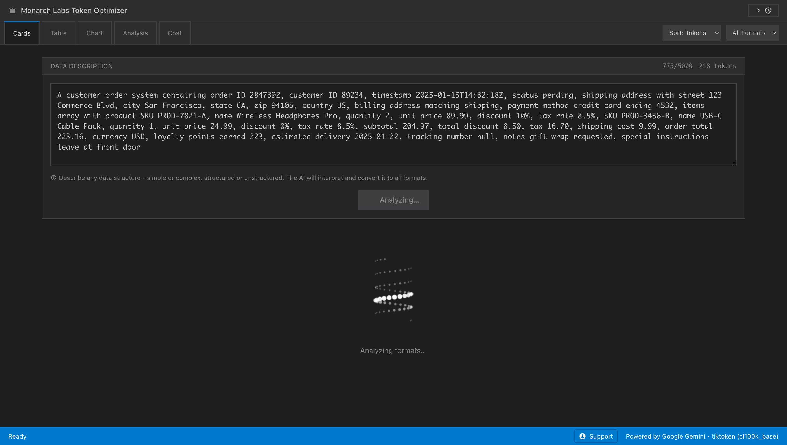
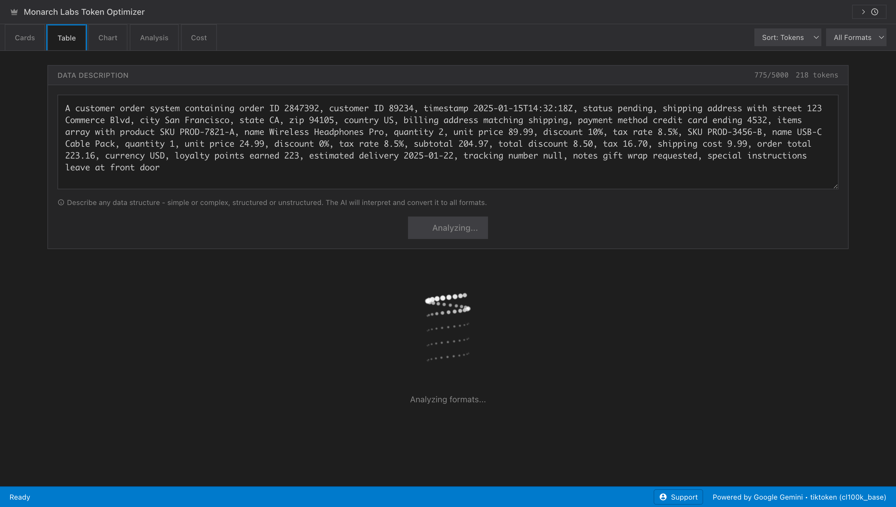
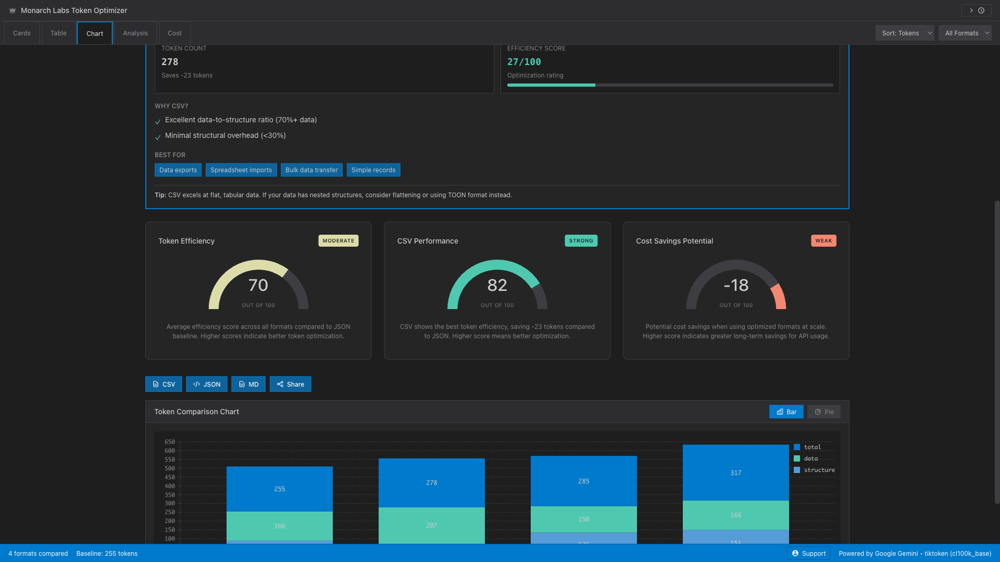
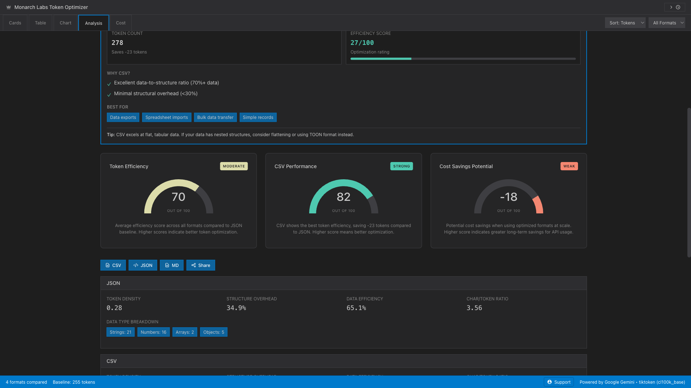
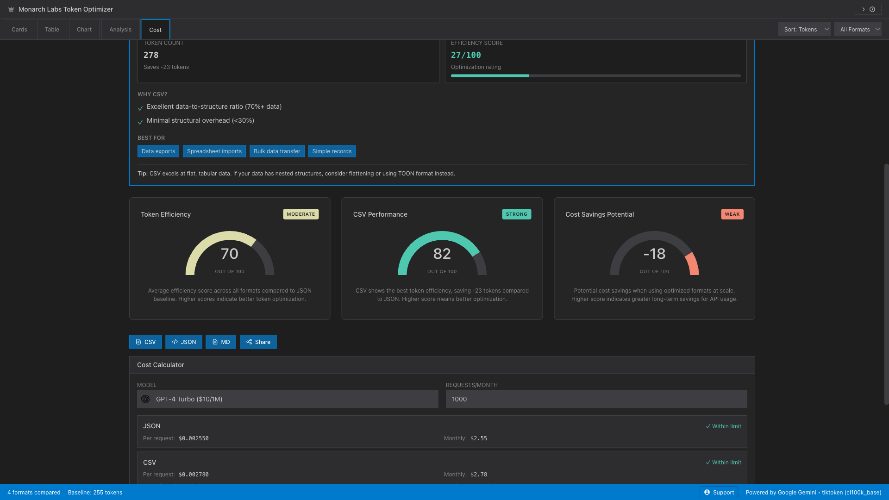
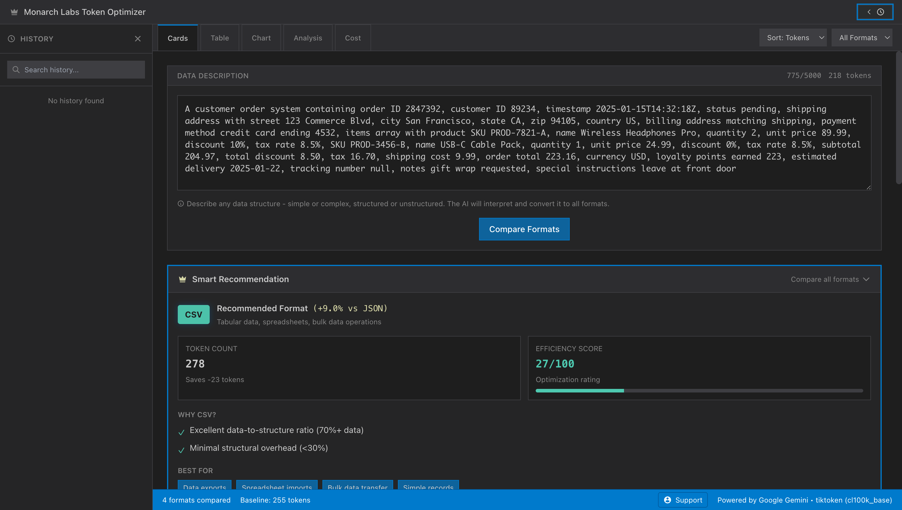

<div align="center">

# 👑 Monarch Labs Token Optimizer

**Advanced token usage analysis and optimization tool for LLM developers**

[](https://www.typescriptlang.org/)
[](https://react.dev/)
[](https://vitejs.dev/)
[](LICENSE)
[](https://nodejs.org/)

[]()
[]()
[]()

</div>

---

## 📋 Table of Contents

- [Overview](#overview)
- [Features](#features)
- [Getting Started](#getting-started)
- [Installation](#installation)
- [Usage](#usage)
- [Keyboard Shortcuts](#keyboard-shortcuts)
- [Architecture](#architecture)
- [Technologies](#technologies)
- [Development](#development)
- [Contributing](#contributing)
- [License](#license)
- [Support](#support)

---

## 🎯 Overview

**Monarch Labs Token Optimizer** is a comprehensive, enterprise-grade tool designed to help developers optimize token usage across different data formats. By comparing token counts for JSON, CSV, TOON, and YAML formats, developers can make informed decisions to reduce LLM API costs and improve efficiency.

### Key Benefits

- 💰 **Cost Optimization**: Reduce API costs by up to 20-30% through format optimization
- 📊 **Real-Time Analysis**: Live token counting and instant format comparison
- 🎨 **Professional UI**: VS Code-inspired dark theme with modern, responsive design
- 🚀 **Performance**: Optimized algorithms and caching for fast, efficient operations
- 🔒 **Privacy-First**: All processing happens client-side; only format generation uses API

---

## 📸 Screenshots

### Homepage & Input

*Clean, professional interface ready for data description input*

### Cards View

*Visual comparison of all formats with syntax-highlighted code, token breakdowns, and cost estimates*

### Table View

*Comprehensive tabular comparison with sortable columns and detailed metrics*

### Chart View

*Interactive Nivo charts showing token distribution and format efficiency*

### Analysis View

*Deep dive into format-specific analytics including token density, structure overhead, and data efficiency*

### Cost Calculator

*Multi-model cost estimation with ROI calculations and monthly/yearly savings projections*

### History Sidebar

*Searchable comparison history with quick access to past analyses*

---

## ✨ Features

### 🎯 Core Capabilities

- **Multi-Format Comparison**: Compare token counts across JSON, CSV, TOON, and YAML formats
- **Real-Time Token Analysis**: Live token counting with tiktoken (cl100k_base encoding)
- **AI-Powered Format Generation**: Uses Google Gemini API to intelligently convert data descriptions
- **Smart Recommendations**: AI-generated format recommendations based on data structure analysis
- **Advanced Analytics**: Deep insights into token distribution, structure overhead, and data efficiency

### 💰 Cost Management

- **Multi-Model Support**: Cost estimation for 15+ LLM models including:
  - OpenAI (GPT-4, GPT-4 Turbo, GPT-3.5 Turbo, GPT-5 Nano)
  - Anthropic Claude (Opus, Sonnet, Haiku)
  - Google Gemini (Pro, 2.5 Pro, 2.5 Flash)
  - Qwen, Llama, GLM, DeepSeek
- **Context Window Validation**: Automatic validation against model context limits
- **ROI Calculator**: Calculate monthly and yearly savings
- **Cost Breakdown**: Per-request and monthly cost estimates

### 📊 Visualization & Analytics

- **Interactive Charts**: Nivo-powered bar and pie charts for visual comparison
- **Token Breakdown**: Structure vs. data ratio analysis
- **Format Efficiency Metrics**: Data density, compactness, and overhead analysis
- **Advanced Metrics**: Token density, nested structure depth, whitespace impact

### 📤 Export & Sharing

- **Multiple Export Formats**: CSV, JSON, Markdown
- **Clipboard Integration**: One-click copy for any format
- **Comparison History**: Save and search through past comparisons
- **Shareable Results**: Export comparison tables and analytics

### 🎨 Developer Experience

- **VS Code-Inspired UI**: Professional IDE-style interface
- **Keyboard Shortcuts**: Power-user navigation and shortcuts
- **Responsive Design**: Fully optimized for mobile, tablet, and desktop
- **Accessibility**: WCAG-compliant with ARIA labels and keyboard navigation
- **Performance Optimized**: Code splitting, lazy loading, and efficient caching

---

## 🚀 Getting Started

### Prerequisites

- **Node.js** 18.0 or higher
- **npm** 9.0+ or **yarn** 1.22+
- **Google Gemini API Key** ([Get one here](https://makersuite.google.com/app/apikey))

### Installation

1. **Clone the repository**:
```bash
git clone https://github.com/bantoinese83/Monarch-Labs-Token-Optimizer.git
cd Monarch-Labs-Token-Optimizer
```

2. **Install dependencies**:
```bash
npm install
```

3. **Set up environment variables**:

Create a `.env.local` file in the root directory:
```env
GEMINI_API_KEY=your_gemini_api_key_here
```

4. **Start the development server**:
```bash
npm run dev
```

5. **Open your browser**:
Navigate to `http://localhost:3000`

---

## 💻 Usage

### Basic Workflow

1. **Enter Data Description**: Describe your data structure in natural language
   - Example: "A customer order with ID, items array, shipping address, and payment info"
   - The AI will interpret and convert it to all formats automatically

2. **View Comparison**: See token counts, cost estimates, and efficiency metrics for each format

3. **Analyze Results**: Review smart recommendations, charts, and detailed analytics

4. **Export**: Copy code or export results in your preferred format

### Advanced Features

- **History**: Access past comparisons from the sidebar
- **Sorting & Filtering**: Organize formats by token count, savings, or efficiency
- **Cost Calculator**: Switch to Cost tab for detailed cost breakdowns
- **Analysis View**: Deep dive into format-specific metrics and insights

---

## ⌨️ Keyboard Shortcuts

| Shortcut | Action |
|----------|--------|
| `Ctrl+K` / `Cmd+K` | Switch to Cards view |
| `Ctrl+T` / `Cmd+T` | Switch to Table view |
| `Ctrl+C` / `Cmd+C` | Switch to Chart view |
| `Ctrl+A` / `Cmd+A` | Switch to Analysis view |
| `Ctrl+D` / `Cmd+D` | Switch to Cost view |
| `Ctrl+H` / `Cmd+H` | Toggle History sidebar |

---

## 🏗️ Architecture

The application follows a modular, scalable architecture:

```
src/
├── components/          # React UI components
│   ├── ResultCard.tsx   # Format comparison cards
│   ├── CostCalculator.tsx # Cost estimation component
│   ├── SmartRecommendations.tsx # AI-powered recommendations
│   └── ...
├── contexts/            # React Context providers
│   ├── AppStateContext.tsx
│   ├── ToastContext.tsx
│   └── HistoryContext.tsx
├── services/            # Business logic & API services
│   ├── geminiService.ts # Google Gemini API integration
│   ├── historyService.ts # LocalStorage persistence
│   └── cacheService.ts  # Caching layer
├── hooks/              # Custom React hooks
│   └── useKeyboardShortcuts.ts
├── utils/              # Utility functions
│   ├── costCalculator.ts
│   ├── analytics.ts
│   ├── recommendations.ts
│   └── ...
├── types/              # TypeScript definitions
│   └── index.ts
└── constants/          # Configuration constants
    ├── costs.ts
    ├── api.ts
    └── ui.ts
```

### Design Principles

- **Separation of Concerns**: Clear boundaries between UI, business logic, and data
- **Type Safety**: Full TypeScript coverage with strict mode
- **Performance**: Code splitting, lazy loading, and efficient state management
- **Accessibility**: WCAG 2.1 AA compliance
- **Maintainability**: Modular, reusable components with clear interfaces

---

## 🛠️ Technologies

### Core Stack

- **[React 19](https://react.dev/)** - Modern UI framework with latest features
- **[TypeScript 5.8](https://www.typescriptlang.org/)** - Type-safe development
- **[Vite 6](https://vitejs.dev/)** - Next-generation build tool
- **[Tailwind CSS 3](https://tailwindcss.com/)** - Utility-first CSS framework

### Key Libraries

- **[@nivo](https://nivo.rocks/)** - Powerful data visualization (bar & pie charts)
- **[tiktoken](https://github.com/openai/tiktoken)** - Fast token counting (cl100k_base)
- **[@google/genai](https://ai.google.dev/)** - Google Gemini API client
- **[Prism.js](https://prismjs.com/)** - Syntax highlighting for code blocks

### Development Tools

- **ESLint** - Code linting and quality
- **Prettier** - Code formatting
- **TypeScript ESLint** - Type-aware linting
- **Knip** - Dead code detection

---

## 🔧 Development

### Available Scripts

| Command | Description |
|---------|-------------|
| `npm run dev` | Start development server (port 3000) |
| `npm run build` | Build for production |
| `npm run preview` | Preview production build locally |
| `npm run lint` | Run ESLint |
| `npm run lint:fix` | Fix ESLint errors automatically |
| `npm run format` | Format code with Prettier |
| `npm run format:check` | Check code formatting |
| `npm run type-check` | Run TypeScript type checking |
| `npm run check` | Run all checks (type, lint, format) |

### Code Quality Standards

- **TypeScript**: Strict mode enabled, 100% type coverage
- **ESLint**: Configured with React and TypeScript rules
- **Prettier**: Consistent code formatting
- **Testing**: Ready for unit and integration tests

### Git Workflow

```bash
# Add remote repository
git remote add origin https://github.com/bantoinese83/Monarch-Labs-Token-Optimizer.git

# Set main branch
git branch -M main

# Push to remote
git push -u origin main
```

---

## 🤝 Contributing

Contributions are welcome! Please follow these guidelines:

1. **Fork the repository**
2. **Create a feature branch**: `git checkout -b feature/amazing-feature`
3. **Commit your changes**: `git commit -m 'Add amazing feature'`
4. **Push to the branch**: `git push origin feature/amazing-feature`
5. **Open a Pull Request**

### Code Style

- Follow existing code style and patterns
- Ensure all checks pass: `npm run check`
- Add TypeScript types for all new code
- Update documentation as needed

---

## 📄 License

This project is **private** and proprietary to **Monarch Labs**. All rights reserved.

---

## 💬 Support

For issues, questions, or feature requests:

- **GitHub Issues**: [Create an issue](https://github.com/bantoinese83/Monarch-Labs-Token-Optimizer/issues)
- **Contact**: Reach out to Monarch Labs support team

---

## 🙏 Acknowledgments

- **Google Gemini** - For powerful AI format generation
- **OpenAI** - For tiktoken tokenization library
- **Nivo** - For beautiful, interactive charts
- **VS Code** - Design inspiration for the IDE-style interface

---

<div align="center">

**Built with ❤️ by Monarch Labs**

[⬆ Back to Top](#-monarch-labs-token-optimizer)

</div>
